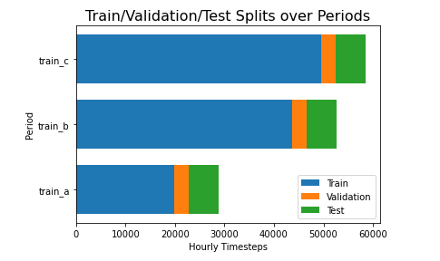
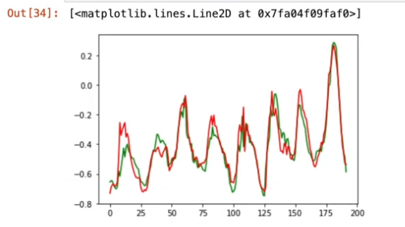

## SolarWind-Dst-LSTM

Forecasting **geomagnetic disturbances (Dst index)** from **solar wind conditions** and **sunspot activity** using a **Long Short-Term Memory (LSTM)** neural network. 

This project explores how space weather affects Earth’s magnetic environment — which matters for satellites, GPS accuracy, energy infrastructure, and deep space missions.

<p align="center">
  
</p>

---

## ✨ Overview

The Sun continuously emits charged particles known as the **solar wind**.  
When solar wind conditions intensify (e.g., during coronal mass ejections), Earth’s geomagnetic field reacts — measured by the **Dst index**.

This project:

- Aggregates high-resolution solar wind data into hourly features  
- Incorporates monthly smoothed sunspot numbers  
- Trains an **LSTM** model to forecast short-range changes in Dst  
- Evaluates performance across multiple solar cycle periods

---

## 🔍 Data Sources

| Dataset | Description |
|--------|-------------|
| **Solar Wind Data** | Hourly solar wind measurements (speed, density, interplanetary magnetic field components, etc.) |
| **Sunspot Numbers** | Smoothed monthly sunspot index (solar cycle strength indicator) |
| **Dst Index** | Disturbance storm-time index — measures geomagnetic field depression (target variable) |

---

## 🧠 Model Architecture

| Component | Details |
|---------|---------|
| Input Window | 32 hours of past data |
| Model | LSTM (512 units, dropout = 0.4) |
| Output | 2-step horizon: Current (`t0`) and Next-hour (`t1`) Dst |
| Loss | Mean Squared Error |
| Optimizer | Adam |

---

## 🔗 Feature Relationships

Understanding how solar wind features interact helps explain which conditions influence geomagnetic storms.
<p align="center">
  
</p>
Key observations:<br>
- Magnetic field components (Bx, By, Bz) show strong internal correlation.<br>
- **Bz** is particularly important — its southward orientation increases geomagnetic storm likelihood.<br>
- Solar wind **density** and **speed** form a distinct physical cluster.<br>
- Sunspot number (`smoothed_ssn`) has a long-scale solar-cycle trend rather than moment-to-moment impact.<br>
<br>
This insight guided feature selection and model architecture choices.

---

## 📦 Project Structure

```bash
/solar-wind-dst-lstm
├── README.md
├── requirements.txt
├── config.yaml
├── .gitignore
│
├── notebooks/
│   └── exploration.ipynb
│
├── models/
│   └── lstm_model.py
│
├── utils/
│   ├── dataset.py
│   ├── metrics.py
│   └── plot.py
│
├── train.py
└── evaluate.py
```
---

## 📊 Train / Validation / Test Split Strategy

Because this is a **time–series forecasting** problem, the data is split chronologically — no shuffling — to preserve temporal structure and avoid data leakage.

The dataset consists of three long observation periods (`train_a`, `train_b`, `train_c`).  
For each period:

- **Train** → Early observations (~70%)
- **Validation** → Middle segment (~15%)
- **Test** → Final segment (~15%)

This ensures the model is always evaluated on **future** data it has never seen.
<p align="center">
  
</p>

## 🚀 Quick Start

**Install dependencies**
```bash
pip install -r requirements.txt
```

---

**Train the model**
```bash
train.py
```

---

**Evaluate performance**
```bash
evaluate.py
```

---

## 📊 Example Performance

| Dataset Split | RMSE  |
| ------------- | ----- |
| Validation    | ~15   |
| Test          | ~13.6 |

Performance varies across solar cycles due to non-linear storm behavior.

---

## 🔮 Forecast vs Reality

One of the core goals of this project is to determine whether solar wind measurements contain enough structure to *predict* geomagnetic disturbance intensity.

The figure below compares the **LSTM model’s prediction** (red) to the **actual Dst index** (green) over a 200–hour window:
<p align="center">
  
</p>

**What we see:**
- The model successfully captures **overall waveform shapes**
- Peaks and troughs are **aligned in time**, meaning temporal patterns are learned
- Amplitude differences appear mainly during **storm intensification events** (expected — these are chaotic and harder to forecast)

This indicates that the model isn’t guessing or overfitting — it’s genuinely learning **physical relationships** between the solar wind and geomagnetic response.


## 🎯 Purpose & Use Cases

* Demonstrates **sequence modeling** on scientific time series data
* Shows **feature engineering** from multi-timescale measurements
* Provides a baseline for **space weather forecasting** research
* Useful portfolio example in **machine learning**, **data science**, and **aerospace / physics domains**

---

## 🖊 License

MIT License 

---

## 🙋‍♀️ Author

@annpeacesnr

